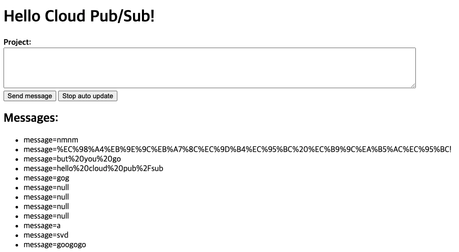
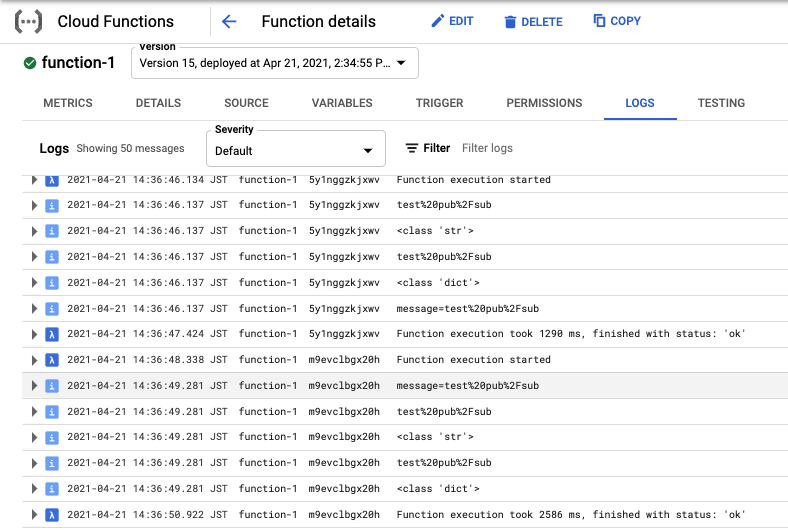
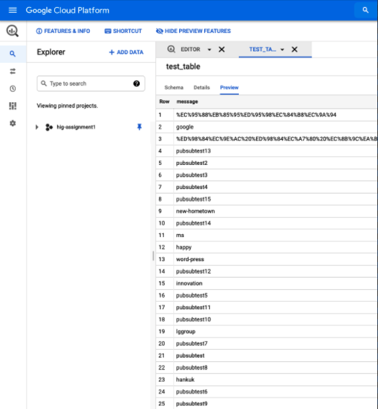

## PHP Composer 설치 및 사용법

- composer는 ruby의 bundle 처럼 패키지간의 의존성을 관리해 주는 유틸리티이다.

---

### Linux/Unix/Mac OS X

```
$ curl -sS https://getcomposer.org/installer | sudo php -- --install-dir=/usr/local/bin/
```

curl이 없을 경우에는 하기 명령어를 이용한다.

```
$ php -r "readfile('https://getcomposer.org/installer');" | php -- --install-dir=/usr/local/bin/
```


## Google Cloud Platform 

## Mac

- python version 확인

```
$ python -V
```


- macOS 64비트(x86_64)
  - https://dl.google.com/dl/cloudsdk/channels/rapid/downloads/google-cloud-sdk-308.0.0-darwin-x86_64.tar.gz?hl=ko
- macOS 32비트(x86)
  - https://dl.google.com/dl/cloudsdk/channels/rapid/downloads/google-cloud-sdk-308.0.0-darwin-x86.tar.gz?hl=ko 

파일 시스템의 임의 위치(예: 홈 디렉토리)에 보관 파일 압축을 풉니다. macOS에서는 다운로드된 `.tar.gz` 보관 파일을 원하는 위치에서 열어 압축을 풀 수 있습니다.


- SDK 초기화

[`gcloud init`](https://cloud.google.com/sdk/gcloud/reference/init?hl=ko) 명령어를 사용하여 여러 가지 일반적인 SDK 설정 작업을 수행할 수 있습니다. 여기에는 SDK 도구가 사용자 계정 사용자 인증 정보를 사용하여 Google Cloud에 액세스하도록 승인하고 기본 SDK 구성을 설정하는 작업이 포함됩니다.

```
$ gcloud init
```


`pubsubAngularProject`로 이동한다. 

```
$ composer install
```

```
$ gcloud app deploy
```


Google Cloud Platform Web Console로 이동한다. 

cloud function 생성 후 `cloudfunctionToBigQuery`에 포함되어 있는 `main.py` 과 `requirements.txt` 코드를 복사합니다.


## 실행

배포된 app engine의 서비스로 이동하여 화면에 보이는 창에 메시지를 입력하게 되면 Cloud Function이 Trigger되서 bigQuery에 메시지를 저장할 수 있습니다. 

✓. Angular Web 상에서 메시지 수집


✓. 수집된 메시지를 Pub/Sub이 바라보는 상태에서 Streaming 수집이 진행되면 Cloud Function이 Trigger됩니다.


✓. 수집된 메시지는 사전에 정의해둔 Schema 형태를 그대로 따르고 Data Warehouse 역할을 하는 bigQuery로 이관을 완료하게 됩니다. 



